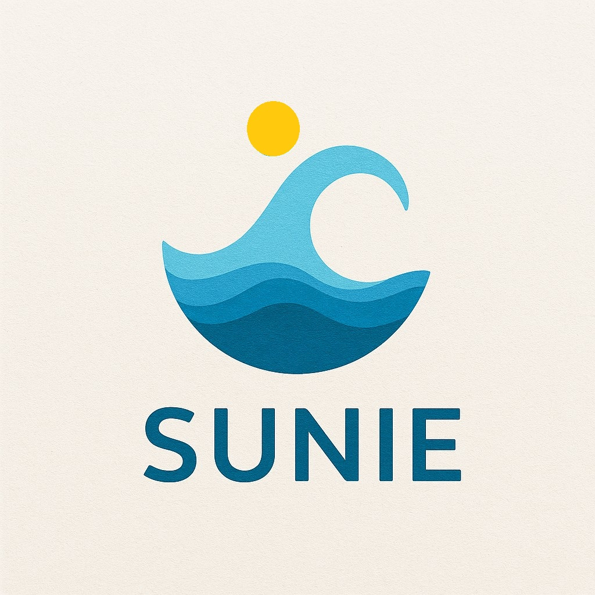

# SUNIE - 教育向けAI-WEBアプリケーション(Client & Server)

## 本件プロジェクトのシステム構成(SUNIE-System)
**技術スタック＆システム全体のデータフロー**  

Client(Streamlit) ←→ SQLite  
⇅  
Nginx  
⇅  
Server(Flask) ←→ PostgreSQL/ElasticSearch  
⇅  
──────────── System-Core ────────────  
Celery  
↓  
RedisQueue  
⇅  
Celery-Worker ←→ PostgreSQL/ElasticSearch  

**制御＆データフローの詳細**

①「Client(Streamlit)」←→「Nginx」←→  
「Server(Flask + gunicorn)」←→「PostgreSQL」「ElasticSearch」。  

②「Client(Streamlit)」←→「Nginx」←→  
「Server(Flask + gunicorn)」←→「System-Core」。  
※「System-Core」＝  
「Celery」→「RedisQue」←→「Celery-Worker」←→  
「PostgreSQL」「ElasticSearch」。  

①は、Server(ダッシュボード)から観た、DBアクセスのルート。  
②は、Celery-Workerから観た、タスク処理に伴うDBアクセスのルート。  

**個々の技術の目的と役割**  

「Client(Streamlit)」＝Web-UI/Web-UX(フロントエンド)。  
「Nginx」＝非同期Webサーバー。  
「Server(Flask + gunicorn)」＝API＆ダッシュボード(バックエンド)。  
「RedisQue」＝メッセージキュー(タスク要求の整理)。  
「Celery」＝タスクワーカーの生成と管理。  
「PostgreSQL」＝保存特化データベース。  
「ElasticSearch」＝検索特化データベース。

**技術選定の理由**  

「Nginx」「RedisQue」「Celery」「PostgreSQL」「ElasticSearch」については、  
将来的なユーザー数の増大や、システムの拡張を見越した技術選定です。  
また、「gunicorn」については、Flaskをバックエンドに採用する関係で必然的な選択になっています。  
特に、「Client(Streamlit)」「Server(Flask + gunicorn)」については、  
既に、日本の公立学校の情報科目の中で採用されているPythonだけでフロントとバックを一貫して記述できることと、  
日本の各自治体ごとに設置されている教育委員会の審議に通りやすくするために、このような選定としました。

## 本件プロジェクトの中心・中核原理(SUNIE-Architecture)
本件プロジェクトの、いわば「心臓部となる部分」(Celery式の推論ワーカー)は、  
ルールベースとニューラルネット(LLM)を混成したハイブリッド仕様となっています。  

**ハイブリッド・ウェハ・ワーカー・アーキテクチャ**

Layer-1 : Gate-Layer (関所層)  
役割 : ルールベースによる入力検証＆RAG引用(ファクト＋ルールのパック化)  

Layer-2 : Interpretation-Layer (解釈層)  
役割 : LLMによるタスクタイプとパラメータの抽出(自然言語を構造化タスクに変換、意図の読み取り) 

Layer-3 : Reasoning-Layer (推論層)  
役割 : ルールベースによるタスク組立て＆タスク実行＆結果解析＆解読ヒント(LLMのためのメタ情報)の生成  

Layer-4 : Expression-Layer (表現層)  
役割：LLMによる応答文生成(意味を言語に変換、文脈に沿った自然な表現、人間に伝わる形に整える)  

Layer-5 : Validation-Layer（検証層）  
役割：ルールベースによる出力検証＆RAGへのルール書戻し(出力安全性チェック、知見・洞察であるルールをRAGベースに書き戻す)  

つまり、アプリ全体の中心処理の流れは、  
「ルールベース→ニューラルネット→ルールベース→ニューラルネット→ルールベース」となります。

## もっとも強調・アピールしたい点
私の構想・開発する、この次世代AIの技術的アイデアによって、  
長年にわたって議論されてきた「フレーム問題」「ハルシネーション問題」「ブラックボックス問題」が解決されて、  
「人間のように 物事を知覚したり 思考したり 判断したり 表現できるAI」を実現させたいと思っています。

## 本件プロジェクトの最終的な目標
私の構想・開発する、この次世代AIによって「全世界の教育の向上に資すること」です。  
「誰もが SUNIEを利用することで 楽しんで教育を受けることができる」。  
より具体的に言えば、教育分野における理解の支援(学術的な再発見機会の提供)。  
そのような未来を夢見ています・・・。

## 開発状況をチェックして下さっている方々へ
本件プロジェクトのロゴは「海を照らす太陽」をイメージして作成しました。  
プロジェクトの進捗を見守ってくださる方々には、感謝の気持ちで一杯です・・・。  
今後とも、本件アプリの進捗を温かく見守って下さると幸いです。

## SUNIEのディレクトリ構造

## SUNIEの使い方

## ライセンス＆免責事項
これらのコードはMITライセンスのもとで公開されています。詳しくは「LISENCE」ファイルを参照してください。

- 改変: 可
- 再利用: 可
- 再頒布: 可

コードファイルに記載された内容は、情報提供のみを目的としています。
したがって、コードを参考にした運用は必ずご自身の責任と判断において行ってください。
コードの内容については、できる限り正確を期していますが、コードの内容に基づく運用結果について、作者は一切の責任を負いかねます。
あらかじめご了承ください。

## 製作・開発者
森下哲博(moriaki1983)

## 連絡先
moriaki1983@outlook.jp
