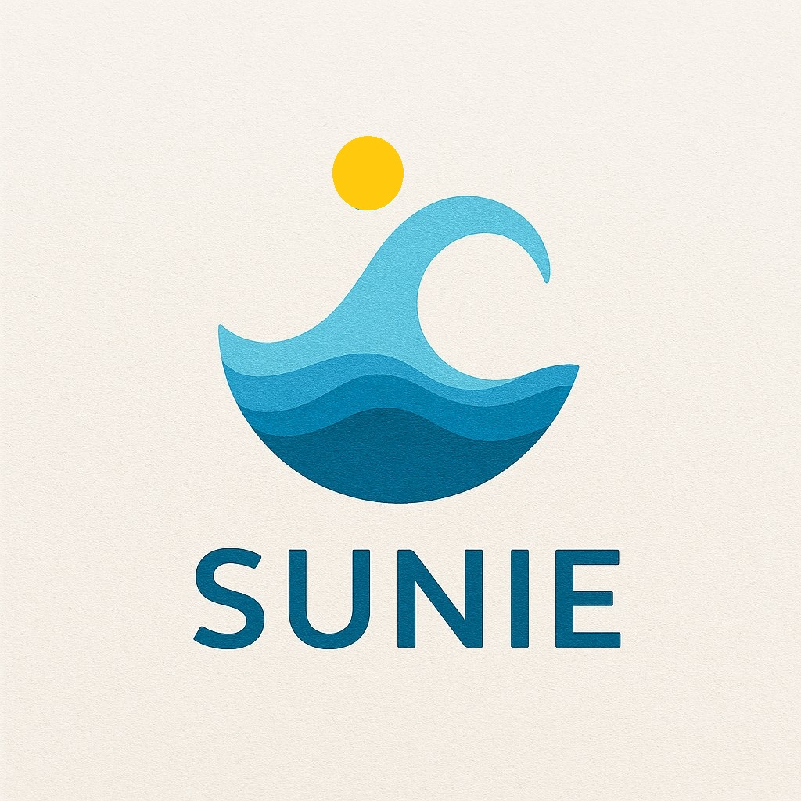

# SUNIE - 教育向けAI-WEBアプリケーション(Client & Server)

## 本件プロジェクトのシステム構成(SUNIE-System)
[SUNIEダイアグラム](./diagram.jpg)

**技術スタック＆システム全体のデータフロー**  

Client(Streamlit) ←→ SQLite  
⇅  
Nginx  
⇅  
Server(Flask) ←→ PostgreSQL/Memgraph  
⇅  
──────────── System-Core ────────────  
Celery  
↓  
Redis/RedisQueue  
⇅  
Celery-Worker ←→ PostgreSQL/Memgraph  

**制御＆データフローの詳細**

①「Client(Streamlit)」←→「Nginx」←→  
「Server(Flask + gunicorn)」←→「PostgreSQL」「Memgraph」。  

②「Client(Streamlit)」←→「Nginx」←→  
「Server(Flask + gunicorn)」←→「System-Core」。  
※「System-Core」＝  
「Celery」→「RedisQue」←→「Celery-Worker」←→  
「PostgreSQL」「Memgraph」。  

①は、Server(ダッシュボード)から観た、DBアクセスのルート。  
②は、Celery-Workerから観た、タスク処理に伴うDBアクセスのルート。  

**個々の技術の目的と役割**  

「Client(Streamlit)」＝Web-UI/Web-UX(フロントエンド)。  
「Nginx」＝非同期Webサーバー。  
「Server(Flask + gunicorn)」＝API＆ダッシュボード(バックエンド)。  
「RedisQue」＝メッセージキュー(タスク要求の整理)。  
「Celery」＝タスクワーカーの生成と管理。  
「PostgreSQL」＝学習・ログイン履歴保存特化データベース。  
「Memgraph」＝教材データ検索特化データベース。

**技術選定の理由**  

「Nginx」「Redis」「RedisQue」「Celery」「PostgreSQL」「Memgraph」については、  
将来的なユーザー数の増大や、システムの拡張を見越した技術選定です。  
また、「gunicorn」については、Flaskをバックエンドに採用する関係で必然的な選択になっています。  
特に、「Client(Streamlit)」「Server(Flask + gunicorn)」については、  
既に、日本の公立学校の情報科目の中で採用されているPythonだけでフロントとバックを一貫して記述できることと、  
日本の各自治体ごとに設置されている教育委員会の審議に通りやすくするために、このような選定としました。

## 本件プロジェクトの中心・中核原理(SUNIE-Architecture)
本件プロジェクトの、いわば「心臓部となる部分」(Celery式の推論ワーカー)は、  
ルールベースとニューラルネット(LLM)を混成したハイブリッド仕様となっています。  

**ハイブリッドAIコワーカー(SUNIEシステム)**

開始
—---------------------
↓
↓
入力検証層(入力の検証)
- 無意味・不適切な語句、システムを混乱させるような入力の排除
↓
↓
入力エンコーディング層(自然言語の曖昧性処理)
- 曖昧な自然言語の変換(ゲーデル符号化＆カントール符号化 等)
- ユーザー意図の抽出
- 後続のコアに渡すための構造化要求の生成
↓
↓
シミュレーションと推論コア(シミュレーションと推論の構造化実行)
- LLMによるユーザー心理の推定・評価に基づくロタリーの調整
- ロタリーの実施結果に基づく概念データとその処理コードの選定
- 要求に含まれる概念データのグラフベース検索・取得
- 概念データ処理コードのリレーショナルベース検索・取得
- 概念データの有効性・妥当性検証
- 安全ステージでの概念データ処理コードの安全性検証
- ゲーデリアン＆カントーリアンに基づくチェーン(シミュレーション＆推論)の構成
- ゲーデリアン＆カントーリアンに基づくチェーン(シミュレーション＆推論)の実行
- 監査ログのリレーショナルベース記録・保存
- 後続の層に渡すための構造化結果(レポート)の生成
↓
↓
出力復号層(構造化結果の自然言語化)
- 明確な人工言語の変換(逆ゲーデル符号化＆逆カントール符号化 等)
- 説明・回答の生成
↓
↓
出力検証層(出力の検証)
- 無意味・不適切な語句、ユーザーを混乱させるような出力の排除
↓
↓
—---------------------
終了

## もっとも強調・アピールしたい点
私の構想・開発する、この次世代AIの技術的アイデアによって、  
長年にわたって議論されてきた「フレーム問題」「ハルシネーション問題」「ブラックボックス問題」が解決されて、  
「人間のように 物事を知覚したり 思考したり 判断したり 表現できるAI」を実現させたいと思っています。

## 本件プロジェクトの最終的な目標
私の構想・開発する、この次世代AIによって「全世界の教育の向上に資すること」です。  
「誰もが SUNIEを利用することで 楽しんで教育を受けることができる」。  
より具体的に言えば、教育分野における理解の支援(学術的な再発見機会の提供)。  
そのような未来を夢見ています・・・。

## 開発状況をチェックして下さっている方々へ
本件プロジェクトのロゴは「海を照らす太陽」をイメージして作成しました。  
プロジェクトの進捗を見守ってくださる方々には、感謝の気持ちで一杯です・・・。  
今後とも、本件アプリの進捗を温かく見守って下さると幸いです。

## SUNIEのディレクトリ構造
SUNIE/  
├── client/  
│   ├── app.py  
│   ├── requirements.txt  
│   └── Dockerfile  
│  
├── server/  
│   ├── app.py  
│   ├── celery_app.py  
│   ├── tasks/  
│   │   ├── __init__.py  
│   │   └── system_task.py  
│   └── requirements.txt  
│  
├── worker/  
│   ├── Dockerfile  
│   └── start-worker.sh  
│  
├── nginx/  
│   └── nginx.conf  
│  
├── logo.jpg  
├── diagram.jpg  
├── docker-compose.yml  
├── CITATION.cff  
├── CONTRIBUTING.md  
├── LICENSE.md  
├── INSTALL.md  
├── SETUP.md  
├── USE.md  
├── DEVELOP.md  
└── README.md

## 本件プロジェクトの導入方法
[SUNIEガイド1](INSTALL.md)

## 本件プロジェクトの立上げ方法
[SUNIEガイド2](SETUP.md)

## 本件プロジェクトの利用方法
[SUNIEガイド3](USE.md)

## 本件プロジェクトの開発方法
[SUNIEガイド4](DEVELOP.md)

## ライセンス＆免責事項
これらのコードはMITライセンスのもとで公開されています。詳しくは「LISENCE」ファイルを参照してください。

- 改変: 可
- 再利用: 可
- 再頒布: 可

コードファイルに記載された内容は、情報提供のみを目的としています。
したがって、コードを参考にした運用は必ずご自身の責任と判断において行ってください。
コードの内容については、できる限り正確を期していますが、コードの内容に基づく運用結果について、作者は一切の責任を負いかねます。
あらかじめご了承ください。

## 製作・開発者
森下哲博(moriaki1983)

## 連絡先
moriaki1983@outlook.jp
